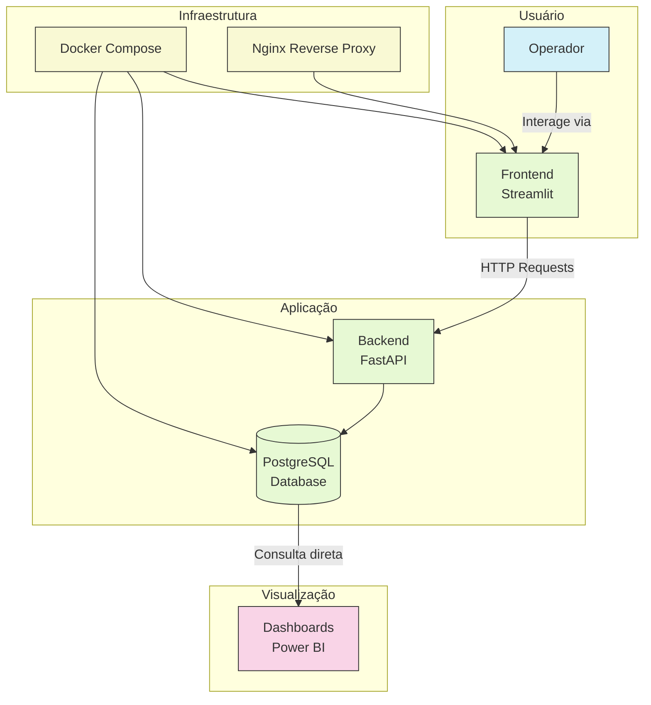
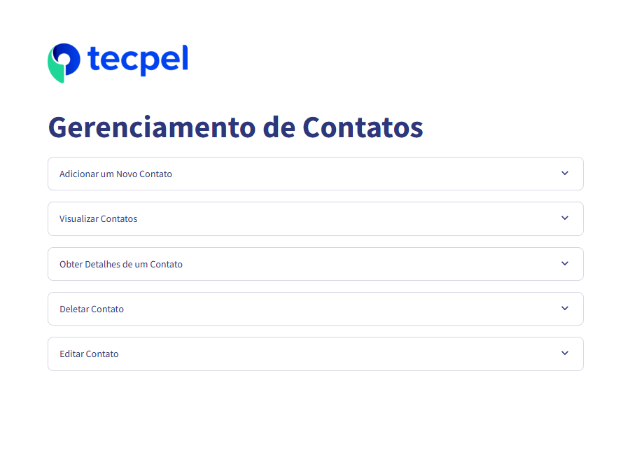
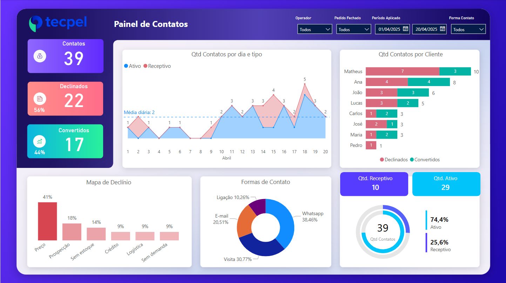

# 📇 Projeto: Gerenciamento de Contatos

Aplicação desenvolvida para registrar e acompanhar os **contatos realizados entre operadores e clientes**, com foco em **efetivação de pedidos de vendas**. O projeto nasceu da necessidade de centralizar e padronizar os registros de contatos, gerando insumos confiáveis para tomada de decisão comercial.

---

## ✅ Propósito

O objetivo principal da aplicação é facilitar o **cadastro de interações com clientes**, sejam elas:

- **Ativas**: quando o operador entra em contato para oferecer produtos.
- **Receptivas**: quando o cliente procura a empresa com uma demanda (Ex: pedir um orçamento).

Esses contatos podem ocorrer por diversos canais, como:

- WhatsApp
- Ligações telefônicas
- E-mail
- Visitas presenciais
- Outros

---

## ⚙️ Arquitetura do Projeto

A aplicação foi desenvolvida com arquitetura de microsserviços containerizados, permitindo escalabilidade e fácil manutenção.



---

## 🧱 Estrutura de Pastas

```plaintext
gerenciamento-de-contatos/
├── backend/                  # Backend com FastAPI + SQLAlchemy
│   ├── main.py               # Inicialização da API
│   ├── crud.py               # Operações de banco
│   ├── database.py           # Conexão PostgreSQL
│   ├── models.py             # Definição dos modelos ORM
│   ├── schemas.py            # Schemas com Pydantic
│   ├── router.py             # Rotas da API
│   ├── requirements.txt
│   └── Dockerfile
│
├── frontend/                 # Interface com Streamlit
│   └── ...
│
├── docker-compose.yml        # Orquestração de containers
├── pyproject.toml            # Configuração do Poetry
├── poetry.lock
```

---

## ✨ Resultado: Visualização em Dashboard

Após o registro dos contatos, os dados são armazenados em um banco de dados PostgreSQL na Digital Ocean e **consumidos diretamente no Power BI** para a criação de um dashboard com indicadores comerciais.

### 📱 Aplicação Web
---


### 📊 Dashboard Power BI
---


---

## 🚀 Como Executar o Projeto

### Pré-requisitos:
- Docker Desktop instalado.

### 1. Crie uma instância do PostgreSQL
Você pode usar serviços como:
- [Render](https://render.com/) (possui plano gratuito)
- [DigitalOcean](https://www.digitalocean.com/) (possui um plano de testes gratuito com U$200 por 60 dias)

### 2. Clone o repositório

```bash
git clone https://github.com/renatolmbezerra/crud-gerenciamento-de-contatos.git
cd crud-gerenciamento-de-contatos
```

### 3. Configure as variáveis de ambiente
Crie um arquivo `.env` na raiz do projeto. Para facilitar, copie o arquivo de exemplo:
```bash
cp .env.example .env
```
Preencha as variáveis com os dados fornecidos pelo serviço onde você criou o banco:
```bash
POSTGRES_HOST=seu_host
POSTGRES_USER=seu_usuario
POSTGRES_PASSWORD=sua_senha
POSTGRES_DB=nome_do_banco
POSTGRES_PORT=sua_porta
POSTGRES_SSLMODE=require
```
### 4. Rode o projeto com Docker
Com o `.env` configurado, inicie o projeto:

```bash
docker-compose up --build
```

A aplicação será executada nos seguintes serviços:

- Frontend: `http://localhost:8501`
- Backend API (Swagger): `http://localhost:8000/docs`

---

## 🌐 Projeto Online

A aplicação está disponível para testes em produção:

- **App Web**: [https://contacts.my-app.ddns-ip.net](https://contacts.my-app.ddns-ip.net)
- **Dashboard (Power BI online)**: [https://app.powerbi.com/view?r=eyJrIjoiNTk1NmQyNmYtMjI2Zi00NzAyLTk3MDktNDY4MWI2MjJkMThlIiwidCI6IjgxZjE0NzY4LWQxMjctNDZlZS1iNGJkLTJhMDA5ZmVjMTYzZiJ9](https://app.powerbi.com/view?r=eyJrIjoiNTk1NmQyNmYtMjI2Zi00NzAyLTk3MDktNDY4MWI2MjJkMThlIiwidCI6IjgxZjE0NzY4LWQxMjctNDZlZS1iNGJkLTJhMDA5ZmVjMTYzZiJ9)

---

## 🧰 Tecnologias Utilizadas

### Backend

- [FastAPI](https://fastapi.tiangolo.com/)
- [SQLAlchemy](https://www.sqlalchemy.org/)
- [Pydantic](https://docs.pydantic.dev/)
- [Uvicorn](https://www.uvicorn.org/)

### Frontend

- [Streamlit](https://streamlit.io/)
- [Pandas](https://pandas.pydata.org/)
- [Requests](https://requests.readthedocs.io/)

### Infraestrutura

- [Docker](https://www.docker.com/)
- [PostgreSQL (Digital Ocean)](https://www.digitalocean.com/)
- [Nginx (reverse proxy)](https://www.nginx.com/)
- [Power BI](https://powerbi.microsoft.com/)
